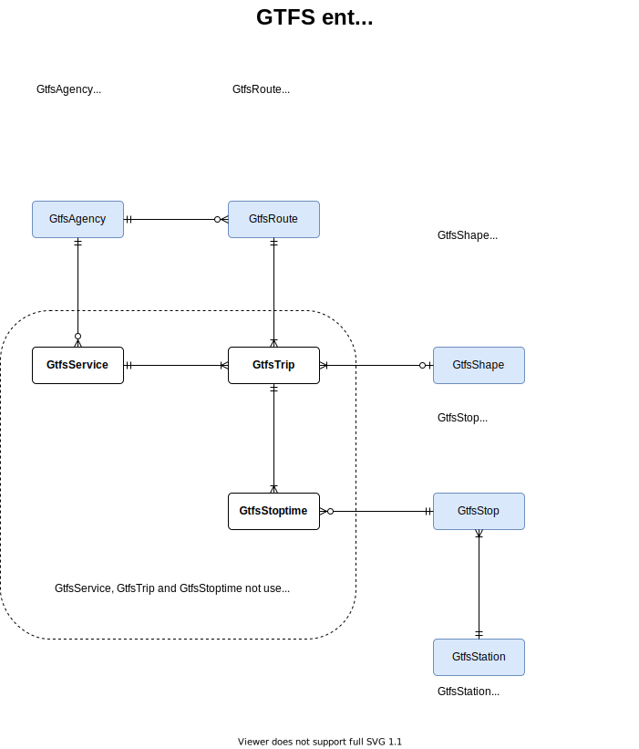

<h2 align="center">
  <a href="https://smart-maas.eu/en/"></a>
  <br>
      SMART MOBILITY SERVICE PLATFORM
  <br>
  <a href="https://smart-maas.eu/en/"></a>
  <br>
</h2>

<p align="center">
  <a href="mailto:info@smart-maas.eu">Contact</a> •
  <a href="https://github.com/SmartMaaS-Services/vbb-rest-2-ngsi/issues">Issues</a> •
  <a href="https://smart-maas.eu/en/">Project Page</a>
</p>


***

<h1 align="center">
  <a>
    vbb-rest-2-ngsi
  </a>
</h1>

***


[](https://spdx.org/licenses/MIT.html)
[](http://stackoverflow.com/questions/tagged/fiware-orion)
[](http://fiware-ges.github.io/orion/api/v2/stable/)
[](https://www.etsi.org/deliver/etsi_gs/CIM/001_099/009/01.02.01_60/gs_cim009v010201p.pdf)

Node.js application that uses the [vbb-rest](https://github.com/derhuerst/vbb-rest) API to read public transport data of the Verkehrsverbund Berlin-Brandenburg (VBB) and transform it from [FTPF](https://github.com/public-transport/friendly-public-transport-format) into a NGSI-compliant data format (NGSI v2 and NGSI-LD) for subsequent storage in FIWARE NGSI Context Brokers. Applied [FIWARE data models](https://fiware-datamodels.readthedocs.io/en/latest/UrbanMobility/doc/introduction/index.html) implement the [General Transit Feed Specification (GTFS)](https://developers.google.com/transit/gtfs/reference).

## Content

-   [Current limitations](#current-limitations)
-   [Prerequisites](#prerequisites)
-   [Operation modes](#operation-modes)
-   [Configuration](#configuration)
-   [Starting Docker containers](#starting-docker-containers)
-   [GTFS entity relationships](#gtfs-entity-relationships)
-   [NGSI data models](#ngsi-data-models)
-   [Reading data from context brokers](#reading-data-from-context-brokers)
-   [History data](#history-data)
-   [Troubleshooting](#troubleshooting)
-   [Known issues](#known-issues)
-   [License](#license)

## Current limitations ## 

* The NGSI data model types `GtfsService` and `GtfsTrip` are not considered yet. Although with regard to the relationship model these types should be harmonised, it's due to the implementation of the REST API that some information is not available or suitable for transformation into context data.
  
  * A `GtfsService` should reference a `GtfsAgency` but various defined service times for routes are not known or cannot be queried via API.
  
  * A `GtfsTrip` may reference a `GtfsShape`, should reference a `GtfsService` and a `GtfsRoute`, but a trip ID always includes date of the day and is often regenerated. Therefore its form is not suitable for transformation into a NGSI entity with fixed ID.

* Due to runtime reasons, instead of querying all stations (~ 13000) from the vbb-rest API only a static subset of 10 selected stations is processed for now.<br>
Furthermore just one possible journey of 10 selected connections (station A -> station B) is picked. It is planned to include all stops/stations and journeys at some point.


## Prerequisites ##

[Docker](https://www.docker.com/) and [Docker Compose](https://github.com/docker/compose) must be installed on your system in order to run the services defined in the multi-container file.


## Operation modes ##

The project offers two different compose files. The first variant starts the Node.js script, the context broker and components for persisting data. In this mode (client-server mode), the retrieved public transport data is stored in the context broker of the local Docker container and, if configured, persisted in the local CrateDB instance.<br>

The second variant comprises a single service for the Node.js script. It acts as a client to a context broker running elsewhere (client mode).


## Configuration ##

There is a configuration file `.env` containing environment variables used by the Node.js script. Some of the variables values have to be modified prior to initial startup, as the script uses those variables for connection management and data processing.<br>

The following list gives a summary of currently supported variables and their description:

<table>
  <tbody>
    <tr>
      <th>Name</th>
      <th>Description</th>
      <th>Default value</th>
    </tr>
    <tr>
      <th colspan="3">Application settings</th>
    </tr>
    <tr>
      <td>
        <code>APP_START_DELAY</code>
      </td>
      <td>
        <p>delayed start: give other required services some time to get started before trying to connect to them [seconds]</p>
        <p><i>mandatory</i></p>
      </td>
      <td>
        20
      </td>
    </tr>
    <tr>
      <th colspan="3">VBB REST Data Source</th>
    </tr>
    <tr>
      <td>
        <code>VBBREST_BASE_URL</code>
      </td>
      <td>
        <p>base URL (VBB REST data source)</p>
        <p><i>mandatory</i></p>
      </td>
      <td>
         https://3.vbb.transport.rest
      </td>
    </tr>
    <tr>
      <td>
        <code>VBBREST_QUERY_INTERVAL</code>
      </td>
      <td>
        <p>interval for re-read data from REST API [seconds]</p>
        <p>NOTE: 24 hours (86400 sec.) as default, please do not stress this public API too much!</p>
        <p><i>mandatory</i></p>
      </td>
      <td>
        86400
      </td>
    </tr>
    <tr>
      <th colspan="3">NGSI v2 Context Broker</th>
    </tr>
    <tr>
      <td>
        <code>BROKER_V2_BASE_URL</code>
      </td>
      <td>
        <p>NGSI v2 context broker URL</p>
        <p>NOTE: modify ONLY, when communicating with external context brokers, e.g. when executing <code>'./services-app-only'</code> which does NOT start any context broker!<br>
          If this broker should not be used, just set an empty value.</p>
        <p><i>optional</i></p>
      </td>
      <td>
        http://orion-v2:1026/v2
      </td>
    </tr>
    <tr>
      <td>
        <code>BROKER_V2_AUTH_KEY</code>
      </td>
      <td>
        <p>Auth key for 'Authorization' header</p>
        <p><i>optional</i></p>
      </td>
      <td>
      </td>
    </tr>
    <tr>
      <td>
        <code>BROKER_V2_API_KEY</code>
      </td>
      <td>
        <p>API key (token for authenticaton)</p>
        <p><i>optional</i></p>
      </td>
      <td>
      </td>
    </tr>
    <tr>
      <td>
        <code>BROKER_V2_TENANT</code>
      </td>
      <td>
        <p>tenant name (a tenant is a service aka domain on the context broker with its own isolated logical database)</p>
        <p><i>optional</i></p>
      </td>
      <td>
        vbb
      </td>
    </tr>
    <tr>
      <td>
        <code>BROKER_V2_SUBTENANT</code>
      </td>
      <td>
        <p>sub-tenant name (a sub-tenant is a sub-service / service path aka project for the given tenant)</p>
        <p><i>optional</i></p>
      </td>
      <td>
        /public_transport
      </td>
    </tr>
    <tr>
      <td>
        <code>BROKER_V2_ENTITY_ID_SUFFIX</code>
      </td>
      <td>
        <p>entity ID suffix (on creation will be appended to an entitys ID for a customized identification format, e.g. the ID suffix 'XY' for a <code>GtfsStop</code> entity '650030877901' will result in <code>GtfsStop:650030877901:XY</code>)</p>
        <p><i>optional</i></p>
      </td>
      <td>
      </td>
    </tr>
    <tr>
      <th colspan="3">NGSI-LD Context Broker</th>
    </tr>
    <tr>
      <td>
        <code>BROKER_LD_BASE_URL</code>
      </td>
      <td>
        <p>NGSI-LD context broker URL</p>
        <p>NOTE: modify ONLY, when communicating with external context brokers, e.g. when executing <code>'./services-app-only'</code> which does NOT start any context broker!<br>
          If this broker should not be used, just set an empty value.</p>
        <p><i>optional</i></p>
      </td>
      <td>
        http://orion-ld:1026/ngsi-ld/v1
      </td>
    </tr>
    <tr>
      <td>
        <code>BROKER_LD_AUTH_KEY</code>
      </td>
      <td>
        <p>Auth key for 'Authorization' header</p>
        <p><i>optional</i></p>
      </td>
      <td>
      </td>
    </tr>
    <tr>
      <td>
        <code>BROKER_LD_API_KEY</code>
      </td>
      <td>
        <p>API key (token for authenticaton)</p>
        <p><i>optional</i></p>
      </td>
      <td>
      </td>
    </tr>
    <tr>
      <td>
        <code>BROKER_LD_TENANT</code>
      </td>
      <td>
        <p>tenant name (a tenant is a service aka domain on the context broker with its own isolated logical database)</p>
        <p><i>optional</i></p>
      </td>
      <td>
        vbb
      </td>
    </tr>
    <tr>
      <td>
        <code>BROKER_LD_SUBTENANT</code>
      </td>
      <td>
        <p>sub-tenant name (a sub-tenant is a sub-service / service path aka project for the given tenant)</p>
        <p><i>optional</i></p>
      </td>
      <td>
        /public_transport
      </td>
    </tr>
    <tr>
      <td>
        <code>BROKER_LD_ENTITY_ID_SUFFIX</code>
      </td>
      <td>
        <p>entity ID suffix (on creation will be appended to an entitys ID for a customized identification format, e.g. the ID suffix 'XY' for a <code>GtfsStop</code> entity '650030877901' will result in <code>urn:ngsi-ld:GtfsStop:650030877901:XY</code>)</p>
        <p><i>optional</i></p>
      </td>
      <td>
      </td>
    </tr>
    <tr>
      <th colspan="3">Historic data persistence</th>
    </tr>
    <tr>
      <td>
        <code>ENABLE_HISTORIC_DATA_STORAGE</code>
      </td>
      <td>
        <p>enables storage of historic data (into Crate-DB via QuantumLeap API for now) - support for NGSI v2 data only</p>
        <p><i>optional</i></p>
      </td>
      <td>
        true
      </td>
    </tr>
    <tr>
      <td>
        <code>QL_V2_NOTIFICATION_BASE_URL</code>
      </td>
      <td>
        <p>QuantumLeap (QL) notification URL used for sending status changes of entities in the context broker</p>
        <p>NOTE: modify ONLY, when communicating with external QL instances, e.g. when executing <code>'./services-app-only'</code> which does NOT start any QL instance!<br>
          If historic data persistence via QL is not wanted, just set an empty value.</p>
        <p><i>optional</i></p>
      </td>
      <td>
        http://quantumleap:8668/v2
      </td>
    </tr>
    <tr>
      <td>
        <code>QL_V2_AUTH_KEY</code>
      </td>
      <td>
        <p>Auth key for 'Authorization' header in requests to QL</p>
        <p><i>optional</i></p>
      </td>
      <td>
      </td>
    </tr>
    <tr>
      <td>
        <code>QL_V2_API_KEY</code>
      </td>
      <td>
        <p>API key for authentication on QL</p>
        <p><i>optional</i></p>
      </td>
      <td>
      </td>
    </tr>
    <tr>
      <td>
        <code>QL_V2_TENANT</code>
      </td>
      <td>
        <p>tenant name on QL</p>
        <p><i>optional</i></p>
      </td>
      <td>
        vbb
      </td>
    </tr>
    <tr>
      <td>
        <code>QL_V2_SUBTENANT</code>
      </td>
      <td>
        <p>sub-tenant name on QL</p>
        <p><i>optional</i></p>
      </td>
      <td>
        /public_transport
      </td>
    </tr>
  </tbody>
</table>


## Starting Docker containers ##

Depending on what operation mode is preferred, pull/create the images and start containers by running `./services create && ./services start` (client-server mode) or simply `./services-app-only start` (client mode) from the project root folder.<br>
To stop the containers run `./services[-app-only] stop`.<br>
If you encounter problems executing the service scripts, add the missing permission with `chmod +x services*`.


## GTFS entity relationships ##




## NGSI data models ##

Read data from the vbb-rest API is harmonised for transformation into applicable FIWARE NGSI data models of the domain Urban Mobility.  
Entites of the following types are sent to the context brokers:

* `GtfsStop` - A stop where vehicles pick up or drop off riders
* `GtfsStation` - A physical structure or area that contains one or more stops
* `GtfsAgency` - 	Transit agency (transportation operator) that offers services at particular times
* `GtfsRoute` - A (transit) route is a group of trips (sequences of two or more stops that occur during a specific time period) that are displayed to riders as a single service.
* `GtfsShape` - Describes the path that a vehicle travels along a route alignment (consists of a sequence of points)

### Entity IDs use the following format: ###
<table>
  <tbody>
    <tr>
      <th>Entity Type</th>
      <th>Entity ID format</th>
    </tr>
    <tr>
      <td>
        <code>GtfsStop</code>
      </td>
      <td>
        <p><code>GtfsStop:&lt;STOP_ID&gt;[:&lt;ENTITY_ID_SUFFIX&gt;]</code></p>
        <p>e.g. <i>GtfsStop:000008012713:XY</i></p>
      </td>
    </tr>
    <tr>
      <td>
        <code>GtfsStation</code>
      </td>
      <td>
        <p><code>GtfsStation:&lt;STATION_ID&gt;[:&lt;ENTITY_ID_SUFFIX&gt;]</code></p>
        <p>e.g. <i>GtfsStation:900000245025:XY</i></p>
      </td>
    </tr>
    <tr>
      <td>
        <code>GtfsAgency</code>
      </td>
      <td>
        <p><code>GtfsAgency:&lt;AGENCY_ID&gt;[:&lt;ENTITY_ID_SUFFIX&gt;]</code></p>
        <p>e.g. <i>GtfsAgency:berliner-verkehrsbetriebe:XY</i></p>
      </td>
    </tr>
    <tr>
      <td>
        <code>GtfsRoute</code>
      </td>
      <td>
        <p><code>GtfsRoute:&lt;ORIGIN_STATION_ID&gt;-&lt;DESTINATION_STATION_ID&gt;[:&lt;ENTITY_ID_SUFFIX&gt;]</code></p>
        <p>e.g. <i>GtfsRoute:900000044201-900000009202:XY</i></p>
      </td>
    </tr>
    <tr>
      <td>
        <code>GtfsShape</code>
      </td>
      <td>
        <p><code>GtfsShape:&lt;ORIGIN_STATION_ID&gt;-&lt;DESTINATION_STATION_ID&gt;[:&lt;ENTITY_ID_SUFFIX&gt;]</code></p>
        <p>e.g. <i>GtfsShape:900000044201-900000009202:XY</i></p>
      </td>
    </tr>
  </tbody>
</table>

<i>Notes:</i> 
* `<ENTITY_ID_SUFFIX>` is an optional ID suffix that will be appended to each entity ID (preceded by a colon '`:`') if configured in the [configuration](#configuration).
* The same rules apply to NGSI-LD entities. The only difference: `urn:ngsi-ld:` is prepended to the entity ID, e.g. <p><i>`urn:ngsi-ld:`GtfsStop:000008012713:XY`</i></p>


## Reading data from context brokers ##

You can GET a list of all entities using the following cURL commands. Don't forget to replace the `<DOCKER_HOST>` placeholders with the hostname / IP of your Docker host.<br>
`<DOCKER_HOST>` assumes that you are running your own context brokers on the Docker host. If you are connecting to context brokers located elsewhere, use their hostname / IP address accordingly.


### Orion v2 ###
List all `GtfsStation` entities containing only the 'id' attribute:  

``` bash
curl -X GET '<DOCKER_HOST>:1026/v2/entities?type=GtfsStation&attrs=id&options=keyValues' \
  -H 'Accept: application/json'
```
  
List all `GtfsStation` entities containing all attributes:  

``` bash
curl -X GET '<DOCKER_HOST>:1026/v2/entities?type=GtfsStation&options=keyValues' \
  -H 'Accept: application/json'
```


## History data ##

If historic data persistence was enabled, the Node.js script sends subscriptions for attribute changes of all known entities to the NGSI v2 context broker. QuantumLeap, a REST service for storing, querying and retrieving spatial-temporal data, will receive a notification every time a status changes and stores its current value in a CrateDB database. With this data collected over time, statistical evaluations and data visualisation will be possible, e.g. building histograms with [Grafana](https://grafana.com/) or UI widgets using [WireCloud](https://github.com/Wirecloud/wirecloud).<br>

As QuantumLeap has no support for NGSI-LD yet, storage of historic data is supported for NGSI v2 data only.<br>

The Docker container of CrateDB exposes 4200 as the default port for data queries and access to the web-based admin UI.<br>
You can reach it at `<DOCKER_HOST>:4200`.


## Troubleshooting ##

CrateDB service might crash shortly after startup due to incompatible memory settings.<br>
With `docker ps -a` you can check whether its container is running or has already exited. In the latter case, inspecting the container log file with 

``` bash
sudo vi `docker inspect --format='{{.LogPath}}' kipark-db-crate`
```

should give you an output saying something like<br>
`max virtual memory areas vm.max_map_count [65530] likely too low, increase to at least [262144]`.<br><br>

In order to avoid this, increase maximum number of memory map areas before starting:

``` bash
sudo sysctl -w vm.max_map_count=262144
```


## Known issues ##

Due to some open issues of the NGSI-LD context broker, unexpected behaviour and errors may appear while executing the script.

* Preceding incomplete query results, causing the Node.js script to attempt to recreate existing entities:<br>
https://github.com/FIWARE/context.Orion-LD/issues/405
  
* Sudden interruption of socket connections to the context broker, making the Orion-LD unreachable afterwards:<br>
https://github.com/FIWARE/context.Orion-LD/issues/408
  
* Unmotivated crashes of the Orion-LD, which also makes the broker unreachable:<br>
https://github.com/FIWARE/context.Orion-LD/issues/406


## License ##

This project is licensed under [MIT License](./LICENSE).
